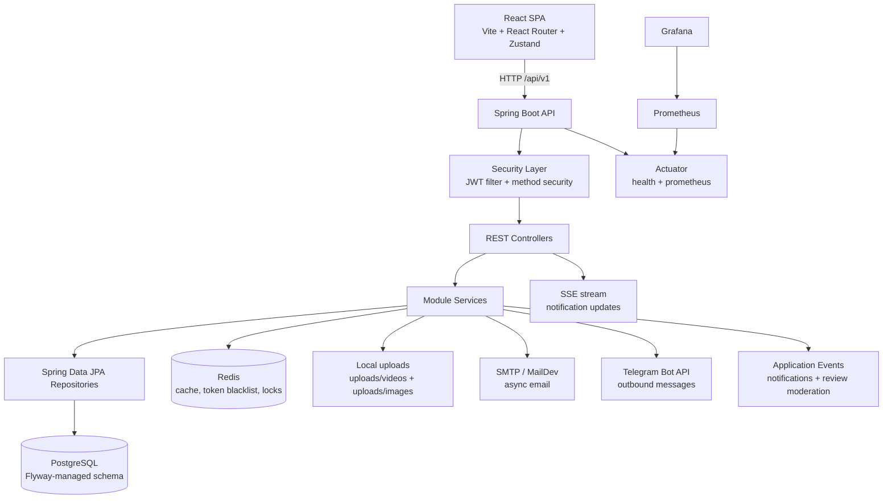
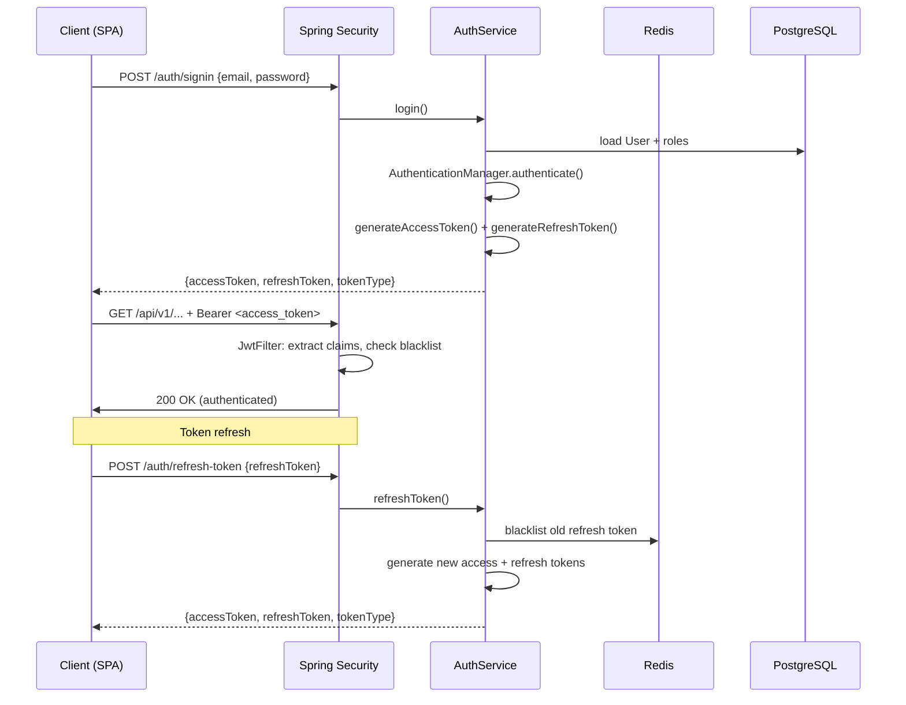
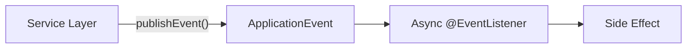

# Architecture

FitHub is a monolithic full-stack fitness studio management platform. The backend is a Spring Boot 4.0.6 application written in Java 21, organized into a shared `core` layer and isolated domain `modules`. The frontend is a React 19 SPA served independently via Vite.

## System Overview



## Backend Package Layout

```
com.dev.quikkkk
├── core/                  # Shared infrastructure
│   ├── config/            # SecurityConfig, RedisConfig, AsyncConfig, WebConfig
│   ├── controller/        # Shared controller concerns
│   ├── dto/               # ErrorResponse, MessageResponse, PageResponse
│   ├── entity/            # BaseEntity (UUID, audit fields)
│   ├── enums/             # ErrorCode
│   ├── exception/         # GlobalExceptionHandler + domain exceptions
│   ├── functional/        # LockOperation functional interface
│   ├── mapper/            # MessageMapper
│   ├── metrics/           # HikariMetricsJob
│   ├── ratelimit/         # IRateLimitService (login brute-force protection)
│   ├── security/          # JwtFilter, JwtKeyProvider, SecurityUser, UserPrincipal
│   ├── service/           # Shared service utilities
│   ├── utils/             # ServiceUtils
│   └── validation/        # Custom annotations (@NonDisposableEmail, @PasswordMatches)
│
├── modules/
│   ├── app/               # Bootstrap / health-check endpoints
│   ├── auth/              # Registration, login, JWT lifecycle, token blacklist, verification
│   ├── dashboard/         # Analytics aggregation
│   ├── membership/        # Memberships, payments, revenue, TRON helpers
│   ├── notification/      # In-app notifications, SSE, email, Telegram
│   ├── nutrition/         # Foods, meal plans, meals, water intake
│   ├── progress/          # Body measurements, photos, goals, personal records
│   ├── review/            # Trainer reviews and moderation
│   ├── storage/           # File upload (local filesystem)
│   ├── user/              # Users, roles, client/trainer profiles, specializations
│   └── workout/           # Sessions, exercises, plans, assignments, attendance, logs
```

Each module follows a consistent internal structure:

```
module/
├── controller/      # @RestController
├── service/         # Interface (IXxxService) + impl/ (XxxServiceImpl)
├── repository/      # Spring Data JPA repository
├── entity/          # JPA @Entity
├── dto/             # request/ and response/ DTOs
├── mapper/          # Entity ↔ DTO mapper
├── enums/           # Module-specific enumerations
├── validator/       # (optional) Module-specific validators
├── scheduler/       # (optional) @Scheduled jobs
├── event/           # (optional) Spring ApplicationEvent subclasses
├── listener/        # (optional) @EventListener handlers
└── realtime/        # (optional) SSE real-time service
```

## Layering Conventions

The request flow follows a strict layered architecture:

```
HTTP Request
    ↓
JwtFilter (extracts Bearer token, populates SecurityContext)
    ↓
@RestController (validates input, delegates to service)
    ↓
IXxxService / XxxServiceImpl (business logic, transaction boundaries)
    ↓
IXxxRepository (Spring Data JPA, query methods)
    ↓
PostgreSQL
```

Key rules:

- **Controllers never contain business logic.** They map HTTP requests to DTOs and delegate to services.
- **Services are defined as interfaces** (`IXxxService`) with implementations in `impl/` sub-packages. This enables mocking in tests and keeps dependency directions clean.
- **Repositories are pure data access.** No business logic lives in repository methods.
- **Entities are never exposed to the API layer.** DTOs (`request/` and `response/` packages) are the contract boundary. Mappers handle conversion.
- **Cross-module data access goes through service interfaces**, never through other modules' repositories.

## Security & Authentication

### JWT Lifecycle



### Security Configuration (`SecurityConfig`)

- **Stateless sessions**: `SessionCreationPolicy.STATELESS` — no HTTP session is created.
- **JWT filter** (`JwtFilter`) runs before `UsernamePasswordAuthenticationFilter`. It extracts the `Bearer` token from the `Authorization` header, validates the token type (ACCESS only), checks the Redis blacklist, verifies expiration, and populates `SecurityContextHolder` with a `UsernamePasswordAuthenticationToken` carrying the user's roles as `SimpleGrantedAuthority("ROLE_*")`.
- **Public endpoint allowlist** in `SecurityConfig.PUBLIC_URLS`: signup, signin, logout, account actions, Telegram webhook, Swagger/OpenAPI, actuator health/prometheus.
- **Method security** enabled via `@EnableMethodSecurity` — services use `@PreAuthorize` for role-based access.
- **Security headers**: HSTS (1 year, include subdomains), X-Frame-Options: DENY, X-Content-Type-Options, Referrer-Policy: strict-origin-when-cross-origin.

### JWT Key Management (`JwtKeyProvider`)

RSA key pairs are resolved in priority order:

1. **Environment variables** (`JWT_PRIVATE_KEY`, `JWT_PUBLIC_KEY`) — production.
2. **Filesystem** (`app.security.jwt.keys-path`) — reads `private_key.pem` / `public_key.pem`.
3. **Auto-generation** (dev/test only, when `app.security.jwt.auto-generate=true`) — generates 2048-bit RSA key pair at startup.

Keys are validated on startup via encrypt/decrypt round-trip test.

### Token Blacklist & Session Locks (Redis)

- **`ITokenBlacklistService`**: Stores blacklisted tokens in Redis with TTL matching token expiration. Checked on every request by `JwtFilter` and on refresh-token rotation. A scheduled job (`VerificationTokenCleanupJob`) cleans expired entries.
- **`ISessionLockService`**: Distributed locks via Redis for concurrent session operations. Uses `executeWithLock(sessionId, operation)` pattern.

### Rate Limiting

`IRateLimitService` tracks login attempts per IP address. On failure, the counter increments; on success, it resets. After exceeding the threshold, the account is temporarily locked.

## Caching Strategy

### Redis Cache (`RedisConfig`)

Per-cache TTL configuration:

| Cache Name | TTL |
|---|---|
| `users` | 30 min |
| `clientProfiles` | 15 min |
| `trainerProfiles` | 1 hour |
| `specializations` | 24 hours |
| `trainingSessions` | 5 min |
| `memberships` | 10 min |
| `attendance` | 30 min |
| `statistics` | 1 hour |
| `workoutLogs` | 15 min |
| `workoutPlans` | 30 min |
| `exercises` | 2 hours |
| `lists` | 5 min |

### Caffeine (In-Memory)

Used for JWT claims parsing cache (5,000 entries, 1-minute TTL). Avoids repeated JWT signature verification on hot paths.

## Event-Driven Patterns

The application uses Spring's `ApplicationEventPublisher` for decoupled cross-cutting concerns:



- **NotificationEvent** → `NotificationEventListener`: Creates in-app notifications, dispatches to SSE real-time channel, sends email/Telegram.
- **ReviewModeratedEvent** → (review listener): Triggers notification when a trainer review is moderated.

Listeners are annotated with `@Async` to run on the `emailTaskExecutor` thread pool, keeping the request thread unblocked.

## Background Jobs

| Job | Module | Schedule | Purpose |
|---|---|---|---|
| `VerificationTokenCleanupJob` | auth | Periodic | Removes expired verification tokens |
| `MembershipExpirationJob` | membership | Periodic | Marks expired memberships, processes freeze/unfreeze |
| `NotificationCleanupJob` | notification | Periodic | Prunes old notification records |
| `NotificationHeartbeatJob` | notification | Periodic (30s) | Sends SSE heartbeat to keep connections alive |
| `HikariMetricsJob` | core | Periodic | Publishes HikariCP connection pool metrics to Micrometer |

## Real-Time Notifications (SSE)

`NotificationRealtimeServiceImpl` manages Server-Sent Events:

- `ConcurrentHashMap<String, CopyOnWriteArrayList<SseEmitter>>` — one emitter list per user ID.
- Clients subscribe via `GET /notifications/stream` → `SseEmitter` with 30-minute timeout.
- `publishToUser(userId, event)` pushes events to all connected emitters for that user.
- Heartbeat job sends comment events every 30 seconds to prevent proxy/browser timeouts.
- Emitter cleanup on completion, timeout, or error.

## Error Handling

`GlobalExceptionHandler` (`@RestControllerAdvice`) provides centralized error mapping:

| Exception | HTTP Status | Code |
|---|---|---|
| `BusinessException` | Per `ErrorCode` | Dynamic |
| `MethodArgumentNotValidException` | 400 | `VALIDATION_ERROR` |
| `DataIntegrityViolationException` | 409 | `DUPLICATE_ENTRY` / `FOREIGN_KEY_ERROR` |
| `AccessDeniedException` | 403 | `ACCESS_DENIED` |
| `BadCredentialsException` | 401 | `INVALID_CREDENTIALS` |
| `DisabledException` | 403 | `ACCOUNT_DISABLED` |
| `ResourceNotFoundException` | 404 | `RESOURCE_NOT_FOUND` |
| Generic `Exception` | 500 | `INTERNAL_SERVER_ERROR` |

All responses use a consistent `ErrorResponse` DTO with `code`, `message`, and optional `validationErrors`.

## Async Processing

`AsyncConfig` defines an `emailTaskExecutor` bean:

- Core pool: 2 threads, max: 5 threads, queue capacity: 100.
- Thread prefix: `email-`.
- Rejected tasks execute in the caller thread (graceful degradation).
- Used by email sending and event listener processing.
