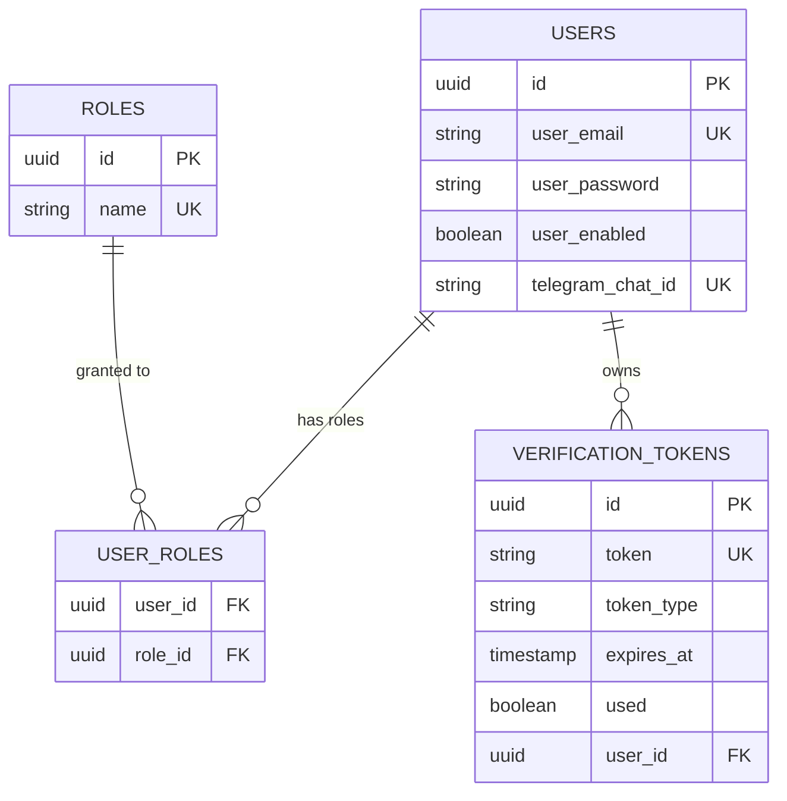
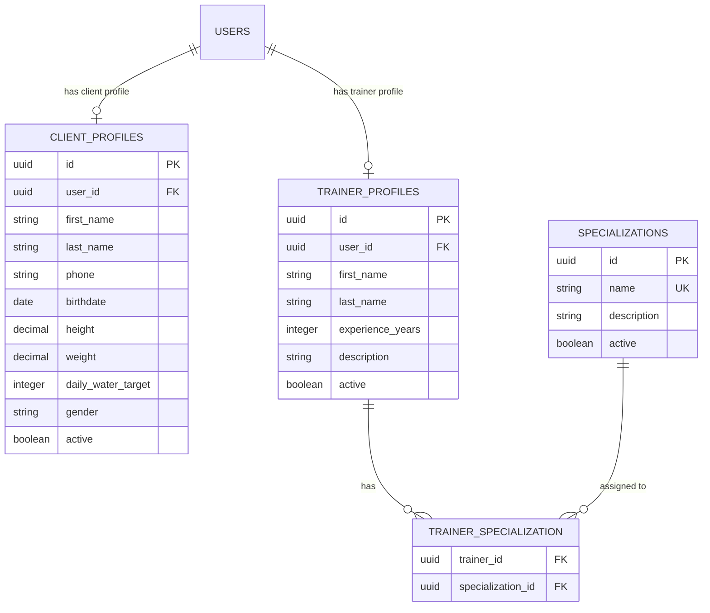
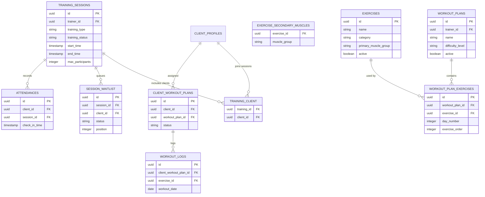
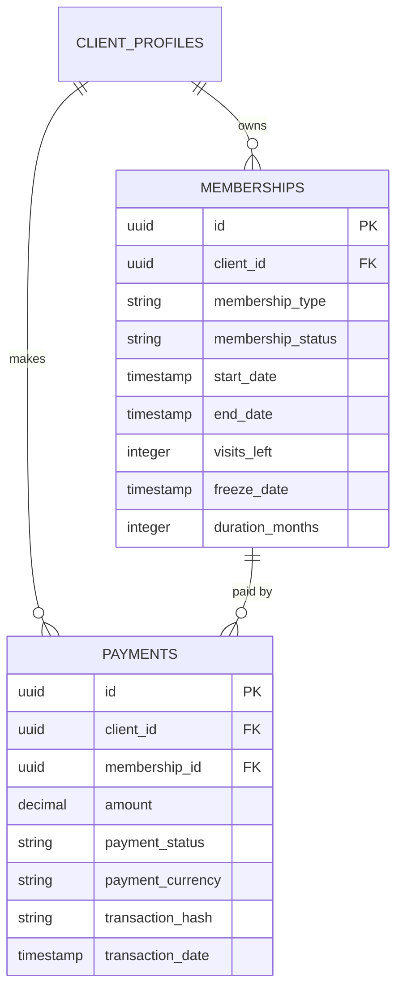
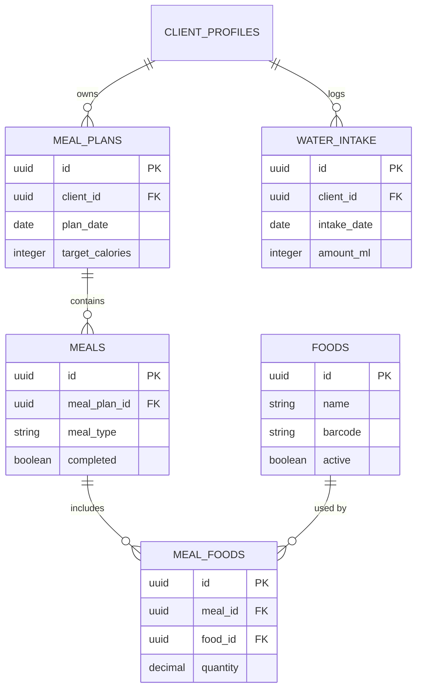
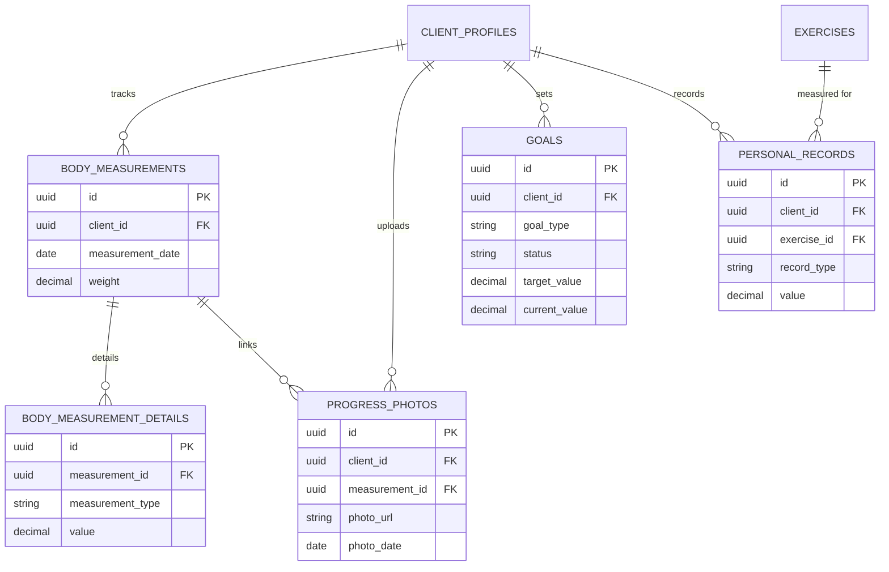
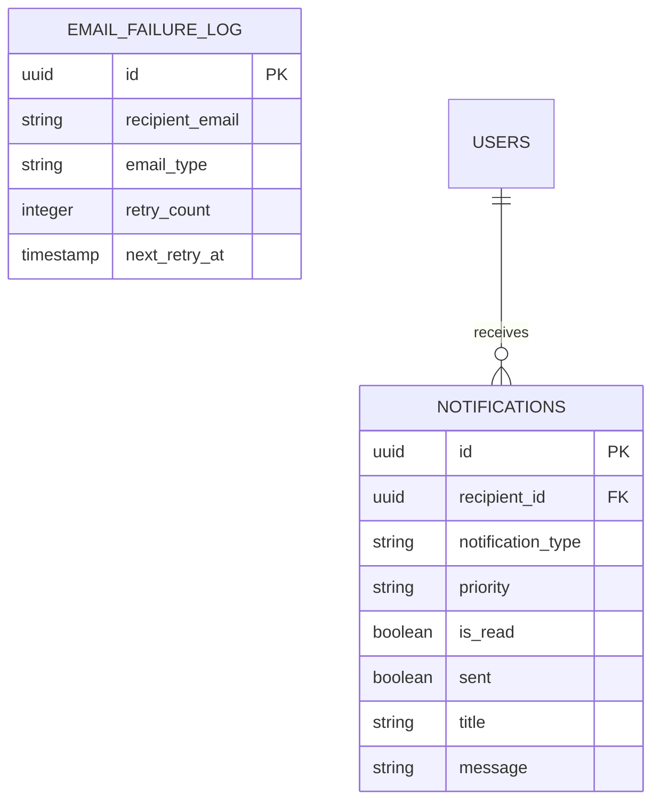
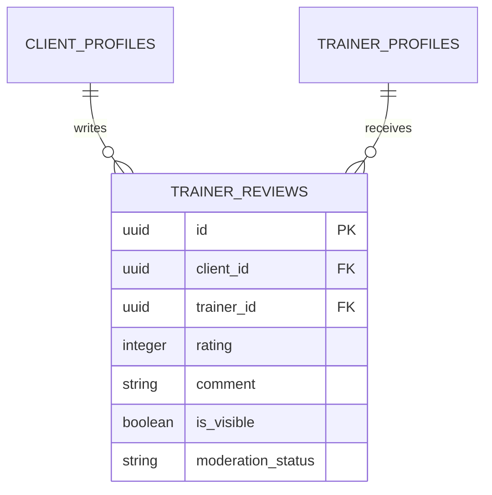

# Database

FitHub uses **PostgreSQL** as its primary data store with **Flyway** for schema migration management. Hibernate runs in `validate` mode — the schema is owned entirely by Flyway.

## Migration Strategy

All schema changes live in `src/main/resources/db/migration/` following Flyway's naming convention: `V{version}__{description}.sql`.

| Migration | Purpose |
|---|---|
| V1 | Auth tables (users, roles, user_roles, verification_tokens) |
| V2 | Profile tables (client_profiles, trainer_profiles, specializations, trainer_specialization) |
| V3 | Membership & payment tables |
| V4 | Training tables (training_sessions, training_client, attendances) |
| V5 | Exercise & workout tables (exercises, workout_plans, workout_plan_exercises, client_workout_plans, workout_logs) |
| V6 | Health/body tables (body_measurements, body_measurement_details, progress_photos, goals, personal_records) |
| V7 | Nutrition tables (foods, meal_plans, meals, meal_foods, water_intake) |
| V8 | Utility tables (email_failure_log) |
| V9 | Default data seeding (roles, specializations, exercises) |
| V10–V29 | Extended seed data, crypto payment fields, notifications, reviews, waitlist, Telegram chat ID, test data |

**Key properties:**

- `flyway.baseline-on-migrate: false` — no baseline for existing databases.
- `flyway.validate-on-migrate: true` — validates checksums before applying.
- `hibernate.ddl-auto: validate` — Hibernate verifies the entity model matches the schema but never modifies it.
- `hibernate.jdbc.batch_size: 20` with `order_updates: true` for write performance.

## Entity Model

All entities extend `BaseEntity`, which provides:

```java
@Id @GeneratedValue(strategy = GenerationType.UUID)
private String id;

@CreatedDate   private LocalDateTime createdDate;
@LastModifiedDate private LocalDateTime lastModifiedDate;
@CreatedBy     private String createdBy;
@LastModifiedBy  private String lastModifiedBy;
```

Audit fields are populated by Spring Data JPA auditing (`@EnableJpaAuditing` + `AuditingEntityListener`).

## Domain Areas

### Authentication & Users



- **User** is the central identity entity. One user can have one `CLIENT_PROFILES` and/or one `TRAINER_PROFILES` (both optional, via `@OneToOne`).
- **Roles**: CLIENT, TRAINER, ADMIN. Assigned at registration (default: CLIENT).
- **VerificationToken**: Supports `EMAIL_VERIFICATION` and `PASSWORD_RESET` token types. TTL-based expiration with `used` flag.

### User Profiles



- Client and trainer profiles are separate entities linked 1:1 to `User`. This allows a single user to theoretically hold both roles.
- **Specialization** is a many-to-many relationship with `TrainerProfile`.

### Training & Workouts



**Training sessions** are the core scheduling unit. A session has a trainer, time range, capacity, and status (SCHEDULED, IN_PROGRESS, COMPLETED, CANCELLED). Clients join sessions via the `training_client` join table, with overflow going to `session_waitlist`.

**Exercises** are a catalog with primary and secondary muscle groups. **Workout plans** are templates created by trainers, containing ordered exercises per day. Plans are assigned to clients via `client_workout Plans`, and execution is tracked in `workout_logs`.

### Memberships & Payments



Membership types include `MONTHLY`, `QUARTERLY`, `YEARLY`, and `VISIT_BASED`. Statuses track lifecycle: `ACTIVE`, `EXPIRED`, `FROZEN`, `CANCELLED`. Freeze functionality pauses the membership with a `freeze_date` reference.

Payments support fiat and crypto (TRON) via `transaction_hash` and `payment_currency` fields.

### Nutrition



Meal plans are daily, containing multiple meals (BREAKFAST, LUNCH, DINNER, SNACK). Each meal links to foods with a quantity. Water intake is tracked separately per day.

### Progress Tracking



Body measurements are snapshots with a weight and detailed breakdown (chest, waist, arms, etc.) via `body_measurement_details`. Progress photos can link to a specific measurement. Goals track target vs. current values. Personal records are exercise-specific PRs.

### Notifications



Notifications support multiple types (SESSION_REMINDER, MEMBERSHIP_EXPIRING, PAYMENT_RECEIVED, etc.) and priorities (LOW, MEDIUM, HIGH, URGENT). The `sent` flag tracks delivery status. Failed emails are logged to `email_failure_log` for retry.

### Reviews



Reviews include moderation support: `is_visible` controls public visibility, and `moderation_status` tracks PENDING/APPROVED/REJECTED states.

## Query Optimization

Entities declare composite indexes aligned with common query patterns:

- `idx_membership_client_status` — client's active memberships lookup
- `idx_session_trainer_start_status` — trainer's upcoming sessions
- `idx_session_status_end` — expiration job queries
- `idx_user_email` (unique) — authentication lookups
- `idx_training_client_training` / `idx_training_client_client` — session participant queries
