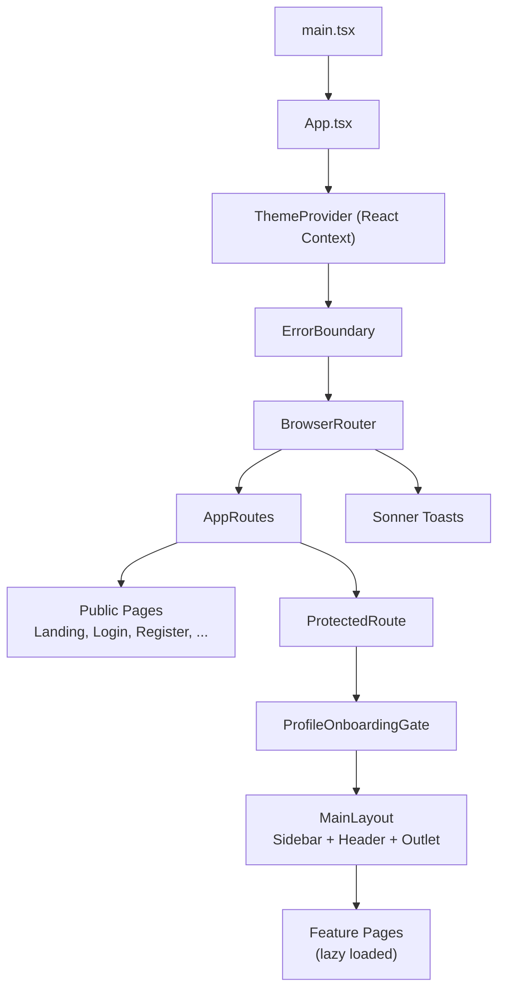
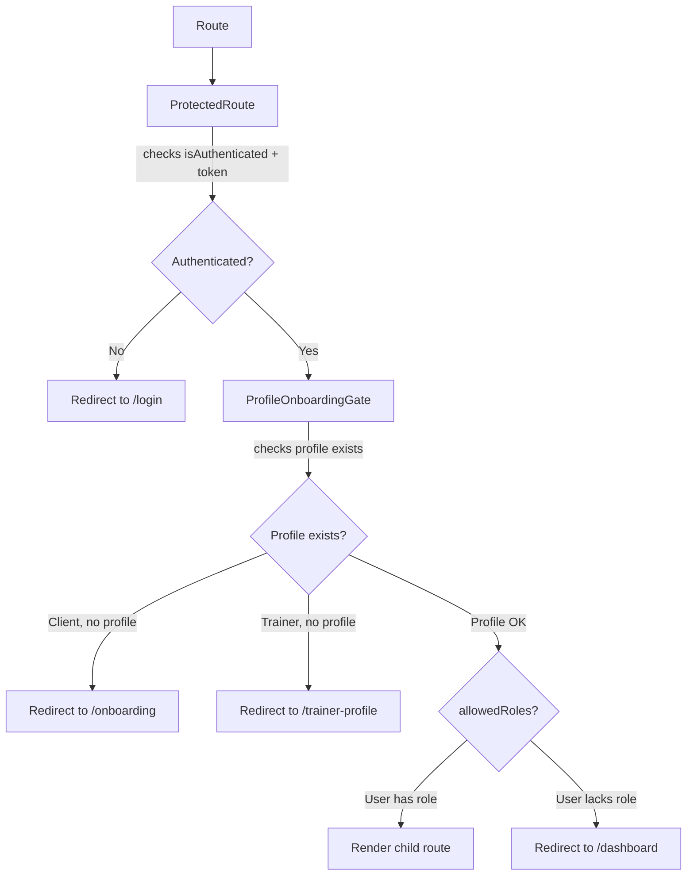
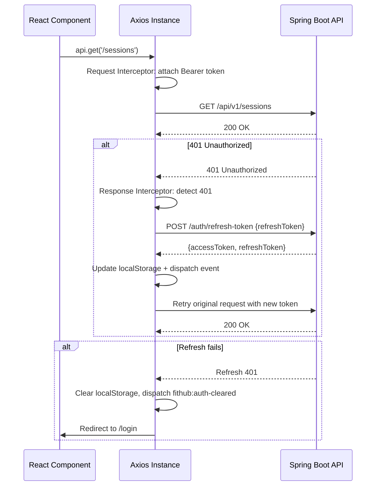

# Frontend

The FitHub frontend is a single-page application built with React 19, TypeScript 5.9, and Vite 7.3. It communicates with the Spring Boot API over HTTP and manages authentication via JWT tokens stored in `localStorage`.

## Architecture Overview



## Technology Stack

| Concern | Library | Version |
|---|---|---|
| Framework | React | 19.2 |
| Language | TypeScript | 5.9 |
| Bundler | Vite | 7.3 |
| Routing | React Router DOM | 7.13 |
| State Management | Zustand | 5.0 |
| HTTP Client | Axios | 1.13 |
| Styling | Tailwind CSS | 3.4 |
| Animation | Framer Motion | 12.35 |
| Charts | Recharts | 3.8 |
| Toasts | Sonner | 1.7 |
| Icons | Lucide React | 0.577 |
| i18n | i18next + react-i18next | 23.16 / 14.1 |

## Directory Structure

```
frontend/src/
├── main.tsx              # Entry point, StrictMode, i18n init
├── App.tsx               # Root component, route definitions
├── index.css             # Tailwind base styles
├── i18n/
│   └── config.ts         # i18next initialization
├── locales/              # Translation JSON files (en, uk, ru)
│   ├── en/
│   ├── uk/
│   └── ru/
├── contexts/
│   └── ThemeContext.tsx   # Light/dark theme provider
├── store/
│   └── useAuthStore.ts   # Zustand auth state
├── services/             # API client layer (16 files)
│   ├── api.ts            # Axios instance + interceptors
│   ├── api-helpers.ts    # handleNotFound utility
│   ├── auth.service.ts
│   ├── user.service.ts
│   ├── profile.service.ts
│   ├── workout.service.ts
│   ├── membership.service.ts
│   ├── payment.service.ts
│   ├── nutrition.service.ts
│   ├── progress.service.ts
│   ├── notification.service.ts
│   ├── review.service.ts
│   ├── dashboard.service.ts
│   ├── trainer.service.ts
│   ├── specialization.service.ts
│   └── app.service.ts
├── types/                # TypeScript type definitions (12 files)
│   ├── auth.types.ts
│   ├── user.types.ts
│   ├── workout.types.ts
│   ├── membership.types.ts
│   ├── nutrition.types.ts
│   ├── progress.types.ts
│   ├── notification.types.ts
│   ├── review.types.ts
│   ├── dashboard.types.ts
│   ├── app.types.ts
│   ├── common.types.ts
│   └── index.ts
├── components/           # Shared components
│   ├── ProtectedRoute.tsx
│   ├── ProfileOnboardingGate.tsx
│   ├── ErrorBoundary.tsx
│   ├── ThemeToggle.tsx
│   ├── LanguageSwitcher.tsx
│   ├── ui/               # Reusable UI primitives
│   ├── memberships/      # Membership-specific components
│   ├── nutrition/        # Nutrition-specific components
│   └── workouts/         # Workout-specific components
├── layouts/
│   └── MainLayout.tsx    # Sidebar + header shell
├── pages/                # Route page components (24 files)
├── assets/               # Static assets
├── lib/                  # Utility libraries
└── utils/                # Helper functions
```

## Routing & Authorization

Routes are defined in `App.tsx` using React Router v7 with nested route elements. Three layers of protection gate access:



**Route groups:**

| Route | Access |
|---|---|
| `/`, `/login`, `/register`, `/verify-email`, `/forgot-password`, `/reset-password` | Public |
| `/dashboard`, `/trainers`, `/notifications` | Any authenticated user |
| `/profile`, `/onboarding`, `/workouts`, `/nutrition`, `/progress`, `/memberships` | CLIENT only |
| `/sessions` | CLIENT or TRAINER |
| `/trainer-workouts`, `/trainer-profile`, `/trainer-sessions` | TRAINER only |
| `/analytics` | TRAINER or ADMIN |
| `/admin`, `/admin/exercises` | ADMIN only |

`ProfileOnboardingGate` ensures clients complete onboarding before accessing the app, and trainers set up their profile.

All page components are **lazy-loaded** via `React.lazy()` with a `<Suspense>` fallback spinner.

## State Management

### Zustand — Auth Store (`useAuthStore`)

The single Zustand store manages authentication state:

```typescript
type AuthState = {
  token: string | null
  refreshToken: string | null
  isAuthenticated: boolean
  user: UserResponse | null
  roles: RoleName[]
  setAuth: (token, refreshToken?, user?) => void
  setUser: (user) => void
  hasRole: (role) => boolean
  hasAnyRole: (roles) => boolean
  clearAuth: () => void
  logout: () => Promise<void>
  fetchCurrentUser: () => Promise<void>
}
```

- Tokens persist in `localStorage` (`access_token`, `refresh_token`).
- On mount, the store reads from `localStorage` and sets `isAuthenticated` if a token exists.
- `fetchCurrentUser()` calls `GET /users/me` to hydrate the user object and roles.
- Custom events (`fithub:auth-cleared`, `fithub:auth-refreshed`) synchronize state across the Axios interceptor and the store.

### React Context — Theme

`ThemeProvider` manages light/dark theme:

- Persists to `localStorage` under key `theme`.
- Falls back to `prefers-color-scheme` system preference.
- Applies `light`/`dark` class to `<html>` for Tailwind dark mode.

## API Layer

### Axios Configuration (`api.ts`)



**Key behaviors:**

- **Request interceptor**: Attaches `Authorization: Bearer <token>` for non-public paths.
- **Response interceptor**: On 401, attempts a single token refresh. Uses a deduplication promise (`refreshPromise`) to prevent concurrent refresh requests.
- **Public path bypass**: `/auth/signin`, `/auth/signup`, `/auth/refresh-token`, `/account-action/*` skip token attachment.
- **Base URL**: Configurable via `VITE_API_BASE_URL`, defaults to `http://localhost:8080/api/v1`.
- **Vite proxy**: Development proxy routes `/api` to `http://localhost:8080`.

### Service Layer Pattern

Each service file maps to a backend domain:

```typescript
// Example: workout.service.ts
export const getTrainingSessions = async (page, size, search?) => {
  const { data } = await api.get<PageResponse<TrainingSessionResponse>>(
    '/sessions',
    { params: { page, size, search } },
  )
  return data
}
```

Services are thin wrappers around the Axios instance. They handle typing and parameter serialization but contain no business logic. Components call services directly (no additional abstraction layer).

`handleNotFound()` utility wraps calls that may legitimately return 404, converting them to `null` instead of throwing.

## Internationalization

i18next is configured with:

- **Languages**: English (`en`), Ukrainian (`uk`), Russian (`ru`).
- **Detection order**: `localStorage` → browser `navigator` language.
- **Namespace-based**: Separate JSON files per feature area (`common`, `auth`, `navigation`, `dashboard`, `profile`, `progress`, `sessions`, `trainers`, `notifications`, `memberships`, `analytics`, `admin`, `onboarding`, `nutrition`, `workouts`).
- **Backend loading**: Translations loaded from `/locales/{lng}/{ns}.json` via HTTP.
- **Fallback**: `en` is the default/fallback language.

Components use `useTranslation()` hook:

```typescript
const { t } = useTranslation('navigation')
// t('sidebar.items.dashboard') → localized string
```

## Component Patterns

### MainLayout

The `MainLayout` component provides the application shell:

- **Desktop**: Fixed 264px sidebar with navigation, user info, and logout button.
- **Mobile**: Slide-out drawer with backdrop overlay, toggled by hamburger button.
- **Header**: Sticky top bar with user greeting, role label, avatar initials, theme toggle, and language switcher.
- **Navigation**: Role-filtered items — each `NavItem` has an optional `roles` array. Items without roles are visible to everyone.

### ProtectedRoute

- Checks `isAuthenticated` and `token` from the auth store.
- If unauthenticated, redirects to `/login` with `state.from` for post-login redirect.
- If authenticated but user data not loaded, shows a loading spinner with a 10-second timeout and retry button.
- If `allowedRoles` is specified and user lacks the required role, redirects to `/dashboard`.

### ProfileOnboardingGate

- For CLIENT users without a `clientProfile`, redirects to `/onboarding`.
- For TRAINER users without a `trainerProfile`, redirects to `/trainer-profile`.
- On the onboarding route, checks if profile was created and redirects to `/dashboard`.

## Build & Optimization

Vite configuration includes manual chunk splitting:

```typescript
manualChunks: {
  'vendor-react': ['react', 'react-dom', 'react-router-dom'],
  'vendor-charts': ['recharts'],
  'vendor-motion': ['framer-motion'],
}
```

This keeps the initial bundle small by splitting large vendor libraries into separate cached chunks.

## Development

```bash
cd frontend
npm install
npm run dev      # Starts Vite dev server on http://localhost:5173
npm run build    # TypeScript check + production build
npm run lint     # ESLint
```
