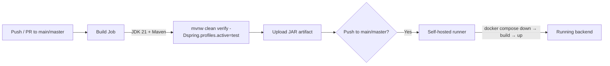
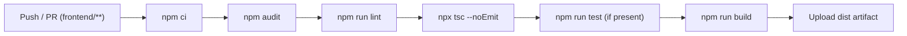

# Infrastructure

FitHub's infrastructure consists of Docker Compose services for local development and production, GitHub Actions CI/CD pipelines, and a monitoring stack with Prometheus and Grafana.

## Services Inventory

| Service | Purpose | Dev Compose | Prod Compose |
|---|---|---|---|
| **PostgreSQL** | Primary database | `docker-compose-dev.yml` | External / managed |
| **Redis** | Cache, token blacklist, session locks | `docker-compose-dev.yml` | `docker-compose.yml` |
| **MailDev** | Local SMTP capture for email testing | Both | Both |
| **Prometheus** | Metrics scraping | `docker-compose-dev.yml` | External |
| **Grafana** | Metrics dashboards | `docker-compose-dev.yml` | External |
| **MinIO** | S3-compatible object storage (available, not active) | — | `docker-compose.yml` |
| **FitHub Backend** | Spring Boot API | `mvnw spring-boot:run` | `docker-compose.yml` (commented out block) |

## Development Setup

### Prerequisites

- Java 21 (Eclipse Temurin recommended)
- Maven 3.9+ (or use the included `mvnw` wrapper)
- Node.js 20+
- Docker and Docker Compose

### Step 1: Start Infrastructure

```bash
cd docker
docker compose -f docker-compose-dev.yml up -d
```

This starts:

| Container | Port | Credentials |
|---|---|---|
| PostgreSQL | `5432` | `postgres` / `postgres`, database `fithub_db` |
| Redis | `6379` | password `password123` |
| MailDev UI | `1080` | No login required |
| MailDev SMTP | `1025` | No auth required |
| Prometheus | `9090` | No auth required |
| Grafana | `3000` | `admin` / `admin` |

### Step 2: Configure Environment

```bash
cp env.example env.properties
```

Minimum values for local development:

```properties
SPRING_PROFILES_ACTIVE=dev
DB_URL=jdbc:postgresql://localhost:5432/fithub_db
DB_USERNAME=postgres
DB_PASSWORD=postgres
MAIL_HOST=localhost
MAIL_PORT=1025
MAIL_USERNAME=
MAIL_PASSWORD=
REDIS_HOST=localhost
REDIS_PORT=6379
REDIS_PASSWORD=password123
JWT_ACCESS_TOKEN_EXPIRATION=86400000
JWT_REFRESH_TOKEN_EXPIRATION=684000000
FRONTEND_URL=http://localhost:5173
APP_CORS_ALLOWED_ORIGINS=http://localhost:4200,http://localhost:5173
TEST_WALLET=
TELEGRAM_TOKEN=
API_TELEGRAM_URL=https://api.telegram.org/bot
```

### Step 3: Run Backend

```bash
# Linux/macOS
./mvnw spring-boot:run

# Windows
.\mvnw.cmd spring-boot:run
```

API starts on `http://localhost:8080`.

### Step 4: Run Frontend

```bash
cd frontend
npm install
npm run dev
```

Frontend starts on `http://localhost:5173` and proxies `/api` requests to the backend.

## Spring Profiles

| Profile | File | Use Case |
|---|---|---|
| `dev` | `application-dev.yaml` | Local development. Default when none specified. Shows SQL, DEBUG logging. |
| `prod` | `application-prod.yaml` | Production. Minimal logging, JWT auto-generation disabled, health details hidden. |
| `test` | `application-test.yaml` | Automated tests with Testcontainers. |

```bash
# Run with specific profile
SPRING_PROFILES_ACTIVE=prod ./mvnw spring-boot:run

# Windows
$env:SPRING_PROFILES_ACTIVE="prod"; .\mvnw.cmd spring-boot:run
```

## Environment Variables

| Variable | Required | Description |
|---|---|---|
| `SPRING_PROFILES_ACTIVE` | Optional | Active Spring profile. Defaults to `dev`. |
| `DB_URL` | Yes | PostgreSQL JDBC URL (without `?prepareThreshold=0` — appended automatically). |
| `DB_USERNAME` | Yes | PostgreSQL username. |
| `DB_PASSWORD` | Yes | PostgreSQL password. |
| `MAIL_HOST` | Yes | SMTP host. Use `localhost` with MailDev. |
| `MAIL_PORT` | Yes | SMTP port. Use `1025` with MailDev. |
| `MAIL_USERNAME` | Yes | SMTP username. Empty for MailDev. |
| `MAIL_PASSWORD` | Yes | SMTP password. Empty for MailDev. |
| `REDIS_HOST` | Yes | Redis host. |
| `REDIS_PORT` | Optional | Redis port. Defaults to `6379`. |
| `REDIS_PASSWORD` | Yes | Redis password. |
| `JWT_ACCESS_TOKEN_EXPIRATION` | Yes | Access token TTL in milliseconds (default: 86400000 = 24h). |
| `JWT_REFRESH_TOKEN_EXPIRATION` | Yes | Refresh token TTL in milliseconds (default: 684000000 = 8 days). |
| `FRONTEND_URL` | Yes | Frontend origin for CORS and email links. |
| `APP_CORS_ALLOWED_ORIGINS` | Optional | Comma-separated allowed origins. Defaults to local dev origins. |
| `TEST_WALLET` | Optional | TRON wallet address for payment validation helpers. |
| `TELEGRAM_TOKEN` | Optional | Telegram bot token. |
| `API_TELEGRAM_URL` | Optional | Telegram API base URL. |
| `VITE_API_BASE_URL` | Optional | Frontend API base URL (default: `http://localhost:8080/api/v1`). |
| `DB_POOL_MAX_SIZE` | Optional | HikariCP max pool size in prod (default: 20). |
| `DB_POOL_MIN_IDLE` | Optional | HikariCP min idle connections in prod (default: 5). |

## Docker

### Backend Image

```bash
./mvnw clean package
docker build -t fithub-backend .
```

`Dockerfile` uses `eclipse-temurin:21-jre-alpine` and runs the JAR with `SPRING_PROFILES_ACTIVE=prod`.

### Development Compose (`docker-compose-dev.yml`)

Starts PostgreSQL, Redis, MailDev, Prometheus, and Grafana with persistent volumes (`pgdata`, `redis_data`). The backend runs outside Docker for faster iteration.

### Production Compose (`docker-compose.yml`)

Starts Redis, MailDev, and MinIO. PostgreSQL is expected to be external/managed. The backend service block is present but commented out — uncomment and provide an `.env` file for self-hosted deployment.

### MinIO

Available as an infrastructure service but **not actively used** by the application. `FileUploadServiceImpl` stores files on the local filesystem under `uploads/videos` and `uploads/images`. MinIO can be enabled for S3-compatible storage in the future.

## Monitoring

### Prometheus

Scrapes Spring Boot Actuator metrics every 5 seconds from `/actuator/prometheus`. Configuration at `docker/config/prometheus.yml`.

### Grafana

Pre-configured with a Prometheus data source. Access at `http://localhost:3000` (admin/admin).

### Actuator Endpoints

Exposed in all profiles:

| Endpoint | Purpose |
|---|---|
| `/actuator/health` | Application health check (HikariCP, Redis, disk space) |
| `/actuator/prometheus` | Prometheus metrics format |

Production hides health details (`show-details: never`).

### Metrics Collected

- HTTP request metrics (percentile histograms)
- HikariCP connection pool metrics (via `HikariMetricsJob`)
- Spring Data JPA repository metrics
- Redis connection metrics
- JVM metrics (automatic via Micrometer)

## CI/CD

### Backend CI (`.github/workflows/backend-ci.yml`)



- Runs on `ubuntu-latest` with a Redis service container.
- Uses Testcontainers for integration tests (PostgreSQL provided by test profile).
- On merge to `main`/`master`: downloads the JAR artifact and deploys via Docker Compose on a self-hosted runner.

### Frontend CI (`.github/workflows/frontend-ci.yml`)



- Triggers only on changes to `frontend/` directory.
- Concurrency group cancels in-progress runs for the same PR.
- Steps: install, audit, lint, type check, test (optional), production build.
- Build artifact uploaded on push to `main`/`master`.

## Logging

- Application logs write to `logs/fithub.log` with pattern: `yyyy-MM-dd HH:mm:ss [thread] LEVEL logger - message`.
- Dev profile: DEBUG level for application code, Hibernate SQL logging enabled.
- Prod profile: WARN level for application, INFO for business events.
- Redis-backed token blacklist and session locks provide distributed coordination without logging overhead.
