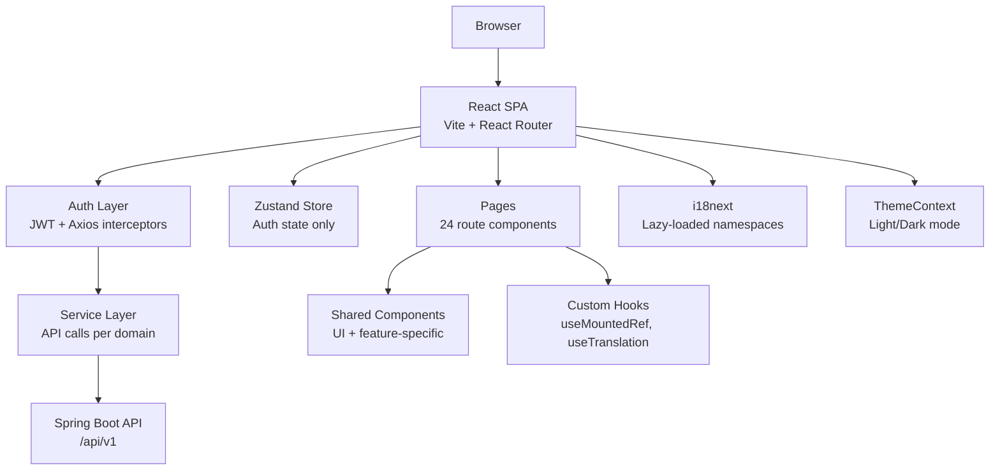

# FitHub — Frontend

FitHub frontend is a React single-page application for the FitHub fitness studio management platform. It provides role-based interfaces for clients, trainers, and administrators with workout planning, session management, nutrition tracking, progress monitoring, payments, reviews, notifications, and analytics.


## Contents

- [Features](#features)
- [Tech Stack](#tech-stack)
- [Architecture](#architecture)
- [Project Structure](#project-structure)
- [Getting Started](#getting-started)
- [Configuration](#configuration)
- [Routing](#routing)
- [State Management](#state-management)
- [Internationalization](#internationalization)
- [Shared Components](#shared-components)
- [Services Layer](#services-layer)
- [Build and Deployment](#build-and-deployment)

## Features

| Area | What it does |
| --- | --- |
| Authentication | Registration, login, email verification, password reset, JWT token management with automatic refresh. |
| Role-based routing | Separate interfaces for clients, trainers, and admins. Protected routes with role guards and onboarding flow. |
| Dashboard | Client dashboard with membership status, upcoming sessions, water intake, workout plans, and progress. Trainer dashboard with session and client stats. Admin dashboard with revenue, attendance, and popular sessions. |
| Workout plans | Browse trainer plans, view assigned plans, log workouts, track completion progress. Trainers can create plans, add exercises, and assign to clients. |
| Training sessions | Browse upcoming sessions, join/leave, waitlist management. Trainers can create sessions, manage attendance, and check in clients. |
| Nutrition | Daily meal plans, food search with barcode scanning, water intake tracking, weekly nutrition views. |
| Progress tracking | Body measurements, goals, personal records, progress photos with monthly trends. |
| Memberships | View active membership, history, payments. Admins can create, activate, freeze, extend, and cancel memberships. |
| Reviews | Clients rate trainers with detailed scores. Admins moderate visibility with reason-based hiding. |
| Notifications | In-app notifications with SSE real-time updates, read/unread management, mark all read. |
| Analytics | Charts for attendance trends, revenue, popular sessions, quick stats. |
| Internationalization | Full i18n support for English, Ukrainian, and Russian with lazy-loaded namespaces. |
| Theming | Light/dark mode toggle with system preference detection. |
| Accessibility | ARIA attributes, keyboard navigation, focus management, screen reader support. |

## Tech Stack

### Core

- React 19.2 with TypeScript 5.9
- Vite 7.3 with React plugin
- React Router 7 for client-side routing

### State and Data

- Zustand 5 for global auth state
- Axios with interceptors for API communication and token refresh
- React Query patterns via custom hooks

### Styling

- Tailwind CSS 3.4 with CSS variable-based theming
- Framer Motion for animations and page transitions
- clsx + tailwind-merge for conditional class merging

### UI and UX

- Lucide React for icons
- Recharts for analytics charts
- Sonner for toast notifications
- i18next with HTTP backend for lazy-loaded translations

### Quality

- ESLint 9 with TypeScript and React hooks plugins
- TypeScript strict mode with additional checks

## Architecture



### Design Principles

- **Local state over global state**: Data fetching uses local `useState` + `useEffect` per page. Only auth state lives in Zustand.
- **Mounted ref pattern**: All async state updates are guarded by `useMountedRef` to prevent updates on unmounted components.
- **Fault-tolerant fetching**: Pages use `Promise.allSettled` for parallel API calls so one failure doesn't break the entire page.
- **Lazy-loaded routes**: All 24 page components are loaded on demand via `React.lazy` for minimal initial bundle.
- **Lazy-loaded i18n**: Translation files are fetched via HTTP backend instead of being bundled.

## Project Structure

```text
frontend/
|-- public/
|   `-- locales/                 # Translation JSON files (en, uk, ru)
|-- src/
|   |-- App.tsx                  # Root component with lazy routes
|   |-- main.tsx                 # Entry point
|   |-- index.css                # Tailwind directives + CSS variables
|   |-- components/
|   |   |-- ui/                  # Shared UI components (16 components)
|   |   |   |-- button.tsx
|   |   |   |-- card.tsx
|   |   |   |-- empty-state.tsx
|   |   |   |-- form-field.tsx   # FormField, Input, Textarea, Select
|   |   |   |-- input.tsx
|   |   |   |-- label.tsx
|   |   |   |-- metric-card.tsx
|   |   |   |-- modal.tsx        # Shared modal with backdrop + escape
|   |   |   |-- pagination.tsx
|   |   |   |-- progress-bar.tsx
|   |   |   |-- skeleton.tsx
|   |   |   |-- star-rating.tsx
|   |   |   |-- status-badge.tsx
|   |   |   |-- status-colors.ts
|   |   |   `-- summary-card.tsx
|   |   |-- workouts/            # Workout-specific modals
|   |   |-- memberships/
|   |   |-- nutrition/
|   |   |-- ErrorBoundary.tsx    # Global error catcher
|   |   |-- ProtectedRoute.tsx   # Auth + role guard
|   |   |-- ProfileOnboardingGate.tsx
|   |   |-- LanguageSwitcher.tsx
|   |   `-- ThemeToggle.tsx
|   |-- pages/                   # 24 page components (lazy-loaded)
|   |-- services/                # API service functions (16 modules)
|   |-- store/                   # Zustand stores (auth only)
|   |-- types/                   # TypeScript interfaces (12 files)
|   |-- utils/                   # Utilities (error handler, toast, mounted ref)
|   |-- lib/                     # Shared helpers (formatDate, formatCurrency, etc.)
|   |-- contexts/                # React contexts (ThemeContext)
|   |-- layouts/                 # Layout components (MainLayout with sidebar)
|   |-- i18n/                    # i18next configuration
|   `-- locales/                 # Source locale files (en, uk, ru)
|-- vite.config.ts
|-- tsconfig.json
|-- tailwind.config.js
|-- eslint.config.js
`-- package.json
```

## Getting Started

### Prerequisites

- Node.js 20+
- npm or yarn
- Backend API running on `http://localhost:8080`

### 1. Install dependencies

```bash
cd frontend
npm install
```

### 2. Start the development server

```bash
npm run dev
```

The frontend starts on `http://localhost:5173`.

### 3. Configure API URL (optional)

By default, the dev server proxies `/api` requests to `http://localhost:8080`. To use a different backend:

```bash
VITE_API_BASE_URL=http://localhost:8080/api/v1 npm run dev
```

## Configuration

### Environment Variables

| Variable | Required | Description |
| --- | --- | --- |
| `VITE_API_BASE_URL` | No | Backend API base URL. Defaults to `http://localhost:8080/api/v1`. |

### Vite Proxy

The dev server proxies `/api` to the backend:

```ts
// vite.config.ts
server: {
  proxy: {
    '/api': {
      target: 'http://localhost:8080',
      changeOrigin: true,
    },
  },
}
```

### Build Chunks

Vendor libraries are split into separate chunks for optimal caching:

| Chunk | Libraries |
| --- | --- |
| `vendor-react` | react, react-dom, react-router-dom |
| `vendor-charts` | recharts |
| `vendor-motion` | framer-motion |

## Routing

All routes are lazy-loaded via `React.lazy`. Route structure:

| Path | Component | Access |
| --- | --- | --- |
| `/` | Landing | Public |
| `/login` | Login | Public |
| `/register` | Register | Public |
| `/verify-email` | VerifyEmail | Public |
| `/forgot-password` | ForgotPassword | Public |
| `/reset-password` | ResetPassword | Public |
| `/dashboard` | Dashboard | Authenticated |
| `/profile` | Profile | Client |
| `/onboarding` | Onboarding | Client |
| `/trainers` | Trainers | Authenticated |
| `/notifications` | Notifications | Authenticated |
| `/workouts` | Workouts | Client |
| `/workouts/:id` | WorkoutDetail | Client |
| `/sessions` | Sessions | Client, Trainer |
| `/nutrition` | Nutrition | Client |
| `/progress` | Progress | Client |
| `/memberships` | Memberships | Client |
| `/analytics` | Analytics | Trainer, Admin |
| `/trainer-workouts` | TrainerWorkouts | Trainer |
| `/trainer-profile` | TrainerProfile | Trainer |
| `/trainer-sessions` | TrainerSessions | Trainer |
| `/admin` | Admin | Admin |
| `/admin/exercises` | ExerciseManagement | Admin |
| `*` | NotFound | Any |

### Route Protection

- `ProtectedRoute` — checks authentication and optional role whitelist
- `ProfileOnboardingGate` — redirects new clients to onboarding if profile is missing

## State Management

### Zustand Store

Only one store exists: `useAuthStore` for authentication state.

| Field | Type | Description |
| --- | --- | --- |
| `token` | `string \| null` | JWT access token |
| `refreshToken` | `string \| null` | JWT refresh token |
| `user` | `UserResponse \| null` | Current user profile |
| `roles` | `string[]` | User roles (ADMIN, TRAINER, CLIENT) |
| `isAuthenticated` | `boolean` | Auth status |

### Local State Pattern

All page data is fetched and managed with local `useState` + `useEffect`:

```tsx
const [data, setData] = useState<Type[]>([])
const [isLoading, setIsLoading] = useState(true)
const mounted = useMountedRef()

useEffect(() => {
  const load = async () => {
    try {
      const result = await apiCall()
      if (mounted.current) setData(result)
    } finally {
      if (mounted.current) setIsLoading(false)
    }
  }
  void load()
}, [])
```

### useMountedRef

Custom hook that prevents state updates on unmounted components:

```tsx
import { useMountedRef } from '../utils/useMountedRef'

const mounted = useMountedRef()
// ...
if (mounted.current) setState(newValue)
```

## Internationalization

### Languages

- English (`en`)
- Ukrainian (`uk`)
- Russian (`ru`)

### Namespaces

17 lazy-loaded namespaces: `common`, `auth`, `landing`, `dashboard`, `profile`, `navigation`, `validation`, `progress`, `sessions`, `trainers`, `notifications`, `memberships`, `analytics`, `admin`, `onboarding`, `nutrition`, `workouts`.

### Configuration

Translations are loaded on demand via `i18next-http-backend` from `/locales/{{lng}}/{{ns}}.json`. Language is auto-detected from `localStorage` or browser settings.

### Usage

```tsx
const { t } = useTranslation(['namespace'])
return <p>{t('key.subkey', { param: value })}</p>
```

## Shared Components

| Component | Location | Description |
| --- | --- | --- |
| `Modal` | `components/ui/modal.tsx` | Backdrop + escape key + click-outside-to-close |
| `FormField` | `components/ui/form-field.tsx` | Label + input wrapper with error display |
| `Input` | `components/ui/form-field.tsx` | Styled text input with error state |
| `Textarea` | `components/ui/form-field.tsx` | Styled textarea with error state |
| `Select` | `components/ui/form-field.tsx` | Styled select dropdown with options |
| `Button` | `components/ui/button.tsx` | Primary/secondary/destructive button variants |
| `Card` | `components/ui/card.tsx` | Card, CardHeader, CardTitle, CardContent |
| `StatusBadge` | `components/ui/status-badge.tsx` | Colored status indicator with label |
| `MetricCard` | `components/ui/metric-card.tsx` | Icon + value + label metric display |
| `SummaryCard` | `components/ui/summary-card.tsx` | Compact stat summary |
| `ProgressBar` | `components/ui/progress-bar.tsx` | Animated progress bar with percentage |
| `EmptyState` | `components/ui/empty-state.tsx` | Empty state with icon, title, action |
| `Skeleton` | `components/ui/skeleton.tsx` | Loading skeleton components |
| `Pagination` | `components/ui/pagination.tsx` | Page navigation with numbered buttons |
| `StarRating` | `components/ui/star-rating.tsx` | Interactive star rating display |
| `InfoTile` | `components/ui/info-tile.tsx` | Icon + label + value info display |

## Services Layer

All API calls are organized by domain in `src/services/`:

| Service | File | Description |
| --- | --- | --- |
| API Core | `api.ts` | Axios instance with JWT interceptors and token refresh |
| API Helpers | `api-helpers.ts` | `handleNotFound` utility for 404→null pattern |
| Auth | `auth.service.ts` | Login, register, email verification, password reset |
| User | `user.service.ts` | User profiles, client search |
| Profile | `profile.service.ts` | Client/trainer profile CRUD |
| Trainer | `trainer.service.ts` | Trainer profiles, reviews, summary |
| Workout | `workout.service.ts` | Exercises, plans, sessions, logs, attendance |
| Nutrition | `nutrition.service.ts` | Foods, meal plans, meals, water intake |
| Progress | `progress.service.ts` | Measurements, goals, records, photos |
| Membership | `membership.service.ts` | Memberships, payments, validation |
| Payment | `payment.service.ts` | Payment processing |
| Notification | `notification.service.ts` | Notifications, SSE stream, broadcast |
| Review | `review.service.ts` | Admin review moderation |
| Dashboard | `dashboard.service.ts` | Analytics data |
| Specialization | `specialization.service.ts` | Trainer specializations |
| App | `app.service.ts` | Bootstrap data |

### Error Handling Pattern

```tsx
import { getApiErrorMessage } from '../utils/errorHandler'
import toast from '../utils/toast'

try {
  await apiCall()
} catch (err) {
  toast.error(getApiErrorMessage(err, t('errors.loadFailed')))
}
```

### 404-to-Null Pattern

For optional resources that may not exist:

```tsx
import { handleNotFound } from '../services/api-helpers'

const membership = await handleNotFound(() =>
  api.get('/memberships/me/active').then(r => r.data)
)
// membership is MembershipResponse | null
```

## Build and Deployment

### Scripts

| Command | Description |
| --- | --- |
| `npm run dev` | Start Vite dev server with hot reload |
| `npm run build` | Type-check (`tsc -b`) then build for production |
| `npm run preview` | Preview production build locally |
| `npm run lint` | Run ESLint |

### Production Build

```bash
npm run build
```

Output goes to `dist/`. The build produces:

- Code-split page chunks (one per route)
- Vendor chunks (react, charts, motion)
- Lazy-loaded i18n JSON files in `dist/locales/`
- Single CSS bundle

### Deployment

Serve `dist/` with any static file server. Ensure the `/api` path is proxied to the backend:

**Nginx example:**

```nginx
location /api {
    proxy_pass http://backend:8080;
}
location / {
    root /usr/share/nginx/html;
    try_files $uri $uri/ /index.html;
}
```

### Docker

The root `Dockerfile` builds both backend and frontend. For frontend-only:

```dockerfile
FROM node:20-alpine AS build
WORKDIR /app
COPY frontend/package*.json ./
RUN npm ci
COPY frontend/ .
RUN npm run build

FROM nginx:alpine
COPY --from=build /app/dist /usr/share/nginx/html
```
