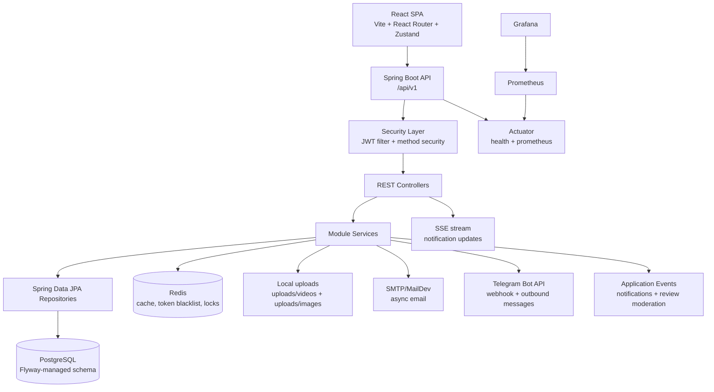

# FitHub — Fitness Studio Management Platform

FitHub is a full-stack fitness studio management platform for gyms, trainers, and clients. It combines authentication, trainer/client profiles, workout planning, session attendance, memberships, payments, nutrition tracking, progress tracking, reviews, notifications, and analytics in one Spring Boot API with a React SPA.


## Contents

- [Features](#features)
- [Tech Stack](#tech-stack)
- [Architecture](#architecture)
- [Database ER Diagram](#database-er-diagram)
- [Project Structure](#project-structure)
- [Getting Started](#getting-started)
- [Configuration](#configuration)
- [API Surface](#api-surface)
- [Security](#security)
- [Background Jobs](#background-jobs)
- [Testing and Quality](#testing-and-quality)
- [Docker and Deployment](#docker-and-deployment)

## Features

| Area | What it does |
| --- | --- |
| Authentication | Registration, login, refresh tokens, logout, email verification, password reset, JWT validation, token blacklisting. |
| Users and profiles | User accounts with roles, separate client and trainer profiles, trainer specializations, active/inactive profile lifecycle. |
| Training sessions | Group or personal training sessions, client join flow, waitlist, trainer check-in, attendance history. |
| Workout plans | Exercise catalog, workout plan creation, ordered plan exercises, client assignments, workout logs. |
| Memberships | Client memberships with activation, freezing, unfreezing, extension, cancellation, validation, and history. |
| Payments | Client payments linked to memberships, revenue analytics, optional TRON transaction metadata and validation helpers. |
| Nutrition | Food catalog, meal plans, meals, meal foods, water intake, daily and weekly nutrition views. |
| Progress tracking | Body measurements, measurement details, progress photos, goals, personal records. |
| Reviews | Client reviews for trainers, rating summaries, admin visibility moderation, moderation events. |
| Notifications | In-app notifications, scheduled notifications, broadcast/send endpoints, SSE stream, email and Telegram integrations. |
| Analytics | Dashboard, trainer, client, attendance, and revenue analytics endpoints. |
| Caching and monitoring | Redis cache manager with per-cache TTLs, actuator health, Prometheus metrics, HikariCP metrics job. |
| File storage | Local filesystem upload directories for images and videos with video range request support. |

## Tech Stack

### Backend

- Java 21
- Spring Boot 4.0.6
- Spring Web MVC, Spring Security, Spring Data JPA, Spring Validation, Spring Mail, Spring Actuator
- PostgreSQL with Flyway migrations
- Redis for cache, token blacklist/session coordination, and application-level locks
- JJWT 0.13.0 with RSA-capable JWT infrastructure
- Springdoc OpenAPI UI
- Micrometer Prometheus registry
- Caffeine dependency available for local cache support
- JUnit 5, Mockito, AssertJ, H2, Testcontainers

### Frontend

- React 19.2
- TypeScript 5.9
- Vite 7.3
- React Router 7
- Zustand
- Axios with access-token attachment and refresh-token retry
- Tailwind CSS 3.4
- Framer Motion
- Recharts
- Sonner
- i18next with English, Ukrainian, and Russian locale files

### Infrastructure

- Docker Compose for PostgreSQL, Redis, MailDev, Prometheus, Grafana, and optional MinIO service
- GitHub Actions for backend and frontend CI
- Self-hosted runner deployment path for the backend workflow

## Architecture



The backend follows a modular package layout:

- `core`: shared configuration, security, validation, exceptions, DTOs, utilities, rate limiting, cache statistics, and metrics.
- `modules.auth`: sign-in/sign-up, JWT lifecycle, verification tokens, password/account actions, token blacklist, session locks.
- `modules.user`: users, roles, client profiles, trainer profiles, specializations.
- `modules.workout`: training sessions, waitlist, attendance, exercises, workout plans, assignments, workout logs.
- `modules.membership`: memberships, payments, revenue, TRON payment helpers.
- `modules.nutrition`: foods, meal plans, meals, water intake.
- `modules.progress`: measurements, progress photos, goals, personal records.
- `modules.notification`: in-app notifications, SSE, email, Telegram.
- `modules.review`: trainer reviews and moderation.
- `modules.dashboard`: analytics.
- `modules.storage`: local file upload and serving helpers.

## Database ER Diagram

This ERD is based on the Flyway migrations in `src/main/resources/db/migration`. It focuses on the main domain tables and relationships; audit columns inherited from the shared base entity are omitted for readability.

```mermaid
erDiagram
    USERS {
        uuid id PK
        string user_email UK
        string user_password
        boolean user_enabled
        string telegram_chat_id
    }

    ROLES {
        uuid id PK
        string name UK
    }

    USER_ROLES {
        uuid user_id FK
        uuid role_id FK
    }

    VERIFICATION_TOKENS {
        uuid id PK
        string token UK
        string token_type
        timestamp expires_at
        boolean used
        uuid user_id FK
    }

    CLIENT_PROFILES {
        uuid id PK
        uuid user_id FK
        string first_name
        string last_name
        string phone
        boolean active
    }

    TRAINER_PROFILES {
        uuid id PK
        uuid user_id FK
        string first_name
        string last_name
        integer experience_years
        boolean active
    }

    SPECIALIZATIONS {
        uuid id PK
        string name UK
        boolean active
    }

    TRAINER_SPECIALIZATION {
        uuid trainer_id FK
        uuid specialization_id FK
    }

    MEMBERSHIPS {
        uuid id PK
        uuid client_id FK
        string membership_type
        string membership_status
        date start_date
        date end_date
    }

    PAYMENTS {
        uuid id PK
        uuid client_id FK
        uuid membership_id FK
        decimal amount
        string payment_status
        string transaction_hash
    }

    TRAINING_SESSIONS {
        uuid id PK
        uuid trainer_id FK
        string title
        string training_type
        string training_status
        timestamp start_time
        timestamp end_time
        integer capacity
    }

    TRAINING_CLIENT {
        uuid training_id FK
        uuid client_id FK
    }

    SESSION_WAITLIST {
        uuid id PK
        uuid session_id FK
        uuid client_id FK
        string status
        integer position
    }

    ATTENDANCES {
        uuid id PK
        uuid client_id FK
        uuid session_id FK
        timestamp check_in_time
    }

    EXERCISES {
        uuid id PK
        string name
        string category
        string primary_muscle_group
        boolean active
    }

    EXERCISE_SECONDARY_MUSCLES {
        uuid exercise_id FK
        string muscle_group
    }

    WORKOUT_PLANS {
        uuid id PK
        uuid trainer_id FK
        string name
        string difficulty_level
        boolean active
    }

    WORKOUT_PLAN_EXERCISES {
        uuid id PK
        uuid workout_plan_id FK
        uuid exercise_id FK
        integer day_number
        integer exercise_order
    }

    CLIENT_WORKOUT_PLANS {
        uuid id PK
        uuid client_id FK
        uuid workout_plan_id FK
        string status
    }

    WORKOUT_LOGS {
        uuid id PK
        uuid client_workout_plan_id FK
        uuid exercise_id FK
        date workout_date
    }

    BODY_MEASUREMENTS {
        uuid id PK
        uuid client_id FK
        date measurement_date
        decimal weight
    }

    BODY_MEASUREMENT_DETAILS {
        uuid id PK
        uuid measurement_id FK
        string measurement_type
        decimal value
    }

    PROGRESS_PHOTOS {
        uuid id PK
        uuid client_id FK
        uuid measurement_id FK
        string photo_url
        date photo_date
    }

    GOALS {
        uuid id PK
        uuid client_id FK
        string goal_type
        string status
        decimal target_value
    }

    PERSONAL_RECORDS {
        uuid id PK
        uuid client_id FK
        uuid exercise_id FK
        string record_type
        decimal value
    }

    FOODS {
        uuid id PK
        string name
        string barcode
        boolean active
    }

    MEAL_PLANS {
        uuid id PK
        uuid client_id FK
        date plan_date
        integer target_calories
    }

    MEALS {
        uuid id PK
        uuid meal_plan_id FK
        string meal_type
        boolean completed
    }

    MEAL_FOODS {
        uuid id PK
        uuid meal_id FK
        uuid food_id FK
        decimal quantity
    }

    WATER_INTAKE {
        uuid id PK
        uuid client_id FK
        date intake_date
        integer amount_ml
    }

    NOTIFICATIONS {
        uuid id PK
        uuid recipient_id FK
        string notification_type
        string priority
        boolean is_read
        boolean sent
    }

    TRAINER_REVIEWS {
        uuid id PK
        uuid client_id FK
        uuid trainer_id FK
        integer rating
        boolean is_visible
    }

    EMAIL_FAILURE_LOG {
        uuid id PK
        string recipient_email
        string email_type
        integer retry_count
    }

    USERS ||--o{ USER_ROLES : has
    ROLES ||--o{ USER_ROLES : grants
    USERS ||--o{ VERIFICATION_TOKENS : owns
    USERS ||--o| CLIENT_PROFILES : client_profile
    USERS ||--o| TRAINER_PROFILES : trainer_profile
    USERS ||--o{ NOTIFICATIONS : receives

    TRAINER_PROFILES ||--o{ TRAINER_SPECIALIZATION : has
    SPECIALIZATIONS ||--o{ TRAINER_SPECIALIZATION : assigned_to
    TRAINER_PROFILES ||--o{ TRAINING_SESSIONS : leads
    TRAINER_PROFILES ||--o{ WORKOUT_PLANS : creates
    TRAINER_PROFILES ||--o{ TRAINER_REVIEWS : receives

    CLIENT_PROFILES ||--o{ MEMBERSHIPS : owns
    CLIENT_PROFILES ||--o{ PAYMENTS : makes
    MEMBERSHIPS ||--o{ PAYMENTS : paid_by

    TRAINING_SESSIONS ||--o{ TRAINING_CLIENT : includes
    CLIENT_PROFILES ||--o{ TRAINING_CLIENT : joins
    TRAINING_SESSIONS ||--o{ SESSION_WAITLIST : queues
    CLIENT_PROFILES ||--o{ SESSION_WAITLIST : waits
    TRAINING_SESSIONS ||--o{ ATTENDANCES : records
    CLIENT_PROFILES ||--o{ ATTENDANCES : checks_in

    EXERCISES ||--o{ EXERCISE_SECONDARY_MUSCLES : targets
    WORKOUT_PLANS ||--o{ WORKOUT_PLAN_EXERCISES : contains
    EXERCISES ||--o{ WORKOUT_PLAN_EXERCISES : used_by
    CLIENT_PROFILES ||--o{ CLIENT_WORKOUT_PLANS : assigned
    WORKOUT_PLANS ||--o{ CLIENT_WORKOUT_PLANS : assigned_as
    CLIENT_WORKOUT_PLANS ||--o{ WORKOUT_LOGS : logs
    EXERCISES ||--o{ WORKOUT_LOGS : logged

    CLIENT_PROFILES ||--o{ BODY_MEASUREMENTS : tracks
    BODY_MEASUREMENTS ||--o{ BODY_MEASUREMENT_DETAILS : details
    CLIENT_PROFILES ||--o{ PROGRESS_PHOTOS : uploads
    BODY_MEASUREMENTS ||--o{ PROGRESS_PHOTOS : links
    CLIENT_PROFILES ||--o{ GOALS : sets
    CLIENT_PROFILES ||--o{ PERSONAL_RECORDS : records
    EXERCISES ||--o{ PERSONAL_RECORDS : measured_for

    CLIENT_PROFILES ||--o{ MEAL_PLANS : owns
    MEAL_PLANS ||--o{ MEALS : contains
    MEALS ||--o{ MEAL_FOODS : includes
    FOODS ||--o{ MEAL_FOODS : used_by
    CLIENT_PROFILES ||--o{ WATER_INTAKE : logs

    CLIENT_PROFILES ||--o{ TRAINER_REVIEWS : writes
```



## Project Structure

```text
.
|-- src/main/java/com/dev/quikkkk
|   |-- core
|   `-- modules
|       |-- app
|       |-- auth
|       |-- dashboard
|       |-- membership
|       |-- notification
|       |-- nutrition
|       |-- progress
|       |-- review
|       |-- storage
|       |-- user
|       `-- workout
|-- src/main/resources
|   |-- application.yaml
|   |-- db/migration
|   `-- keys/local-only
|-- src/test/java/com/dev/quikkkk
|-- frontend
|   |-- src
|   |   |-- components
|   |   |-- contexts
|   |   |-- layouts
|   |   |-- locales
|   |   |-- pages
|   |   |-- services
|   |   |-- store
|   |   `-- types
|   `-- package.json
|-- docker
|   |-- docker-compose-dev.yml
|   |-- docker-compose.yml
|   `-- config
|-- Dockerfile
|-- pom.xml
`-- env.example
```

## Getting Started

### Prerequisites

- Java 21
- Maven wrapper from this repository, or Maven 3.9+
- Node.js 20+
- Docker and Docker Compose

### 1. Start local infrastructure

```bash
cd docker
docker compose -f docker-compose-dev.yml up -d
```

The development compose file starts:

| Service | Port | Default credentials |
| --- | --- | --- |
| PostgreSQL | `5432` | database `fithub_db`, user `postgres`, password `postgres` |
| Redis | `6379` | password `password123` |
| MailDev UI | `1080` | no login |
| MailDev SMTP | `1025` | no login |
| Prometheus | `9090` | no login |
| Grafana | `3000` | `admin` / `admin` |

### 2. Configure environment

Create `env.properties` in the project root:

```bash
cp env.example env.properties
```

For the development compose file, these values are enough to boot locally:

```properties
SPRING_PROFILES_ACTIVE=dev
DB_URL=jdbc:postgresql://localhost:5432/fithub_db
DB_USERNAME=postgres
DB_PASSWORD=postgres
MAIL_HOST=localhost
MAIL_PORT=1025
MAIL_USERNAME=
MAIL_PASSWORD=
REDIS_HOST=localhost
REDIS_PORT=6379
REDIS_PASSWORD=password123
JWT_ACCESS_TOKEN_EXPIRATION=86400000
JWT_REFRESH_TOKEN_EXPIRATION=684000000
FRONTEND_URL=http://localhost:5173
APP_CORS_ALLOWED_ORIGINS=http://localhost:4200,http://localhost:5173
TEST_WALLET=
TELEGRAM_TOKEN=
API_TELEGRAM_URL=https://api.telegram.org/bot
```

### 3. Run the backend

On Linux/macOS:

```bash
./mvnw spring-boot:run
```

On Windows:

```powershell
.\mvnw.cmd spring-boot:run
```

The API starts on `http://localhost:8080`.

Useful backend URLs:

- Swagger UI: `http://localhost:8080/swagger-ui.html`
- OpenAPI JSON: `http://localhost:8080/v3/api-docs`
- Health: `http://localhost:8080/actuator/health`
- Prometheus metrics: `http://localhost:8080/actuator/prometheus`

### 4. Run the frontend

```bash
cd frontend
npm install
npm run dev
```

The frontend starts on `http://localhost:5173`.

By default, the frontend calls `http://localhost:8080/api/v1`. Override it with:

```bash
VITE_API_BASE_URL=http://localhost:8080/api/v1
```

## Configuration

Backend configuration is loaded from `src/main/resources/application.yaml` and optionally imports the root-level `env.properties` file. Spring profiles are split into:

| Profile | File | Use case |
| --- | --- | --- |
| `dev` | `application-dev.yaml` | Local development. This is the default profile when no profile is provided. |
| `prod` | `application-prod.yaml` | Production/container runtime with stricter logging and JWT auto-generation disabled. |
| `test` | `application-test.yaml` | Automated tests and integration tests. |

Run a specific profile with:

```bash
SPRING_PROFILES_ACTIVE=prod ./mvnw spring-boot:run
```

On Windows:

```powershell
$env:SPRING_PROFILES_ACTIVE="prod"; .\mvnw.cmd spring-boot:run
```

| Variable | Required | Description |
| --- | --- | --- |
| `SPRING_PROFILES_ACTIVE` | Optional | Active Spring profile. Defaults to `dev` locally; the Docker image sets `prod`. |
| `DB_URL` | Yes | PostgreSQL JDBC URL without the `prepareThreshold=0` suffix. The app appends it in `application.yaml`. |
| `DB_USERNAME` | Yes | PostgreSQL username. |
| `DB_PASSWORD` | Yes | PostgreSQL password. |
| `MAIL_HOST` | Yes | SMTP host. Use `localhost` with MailDev. |
| `MAIL_PORT` | Yes | SMTP port. Use `1025` with MailDev. |
| `MAIL_USERNAME` | Yes | SMTP username. Can be empty for MailDev. |
| `MAIL_PASSWORD` | Yes | SMTP password. Can be empty for MailDev. |
| `REDIS_HOST` | Yes | Redis host. |
| `REDIS_PORT` | Optional | Redis port. Defaults to `6379`. |
| `REDIS_PASSWORD` | Yes | Redis password. |
| `JWT_ACCESS_TOKEN_EXPIRATION` | Yes | Access token TTL in milliseconds. |
| `JWT_REFRESH_TOKEN_EXPIRATION` | Yes | Refresh token TTL in milliseconds. |
| `FRONTEND_URL` | Yes | Frontend origin used for CORS-related flows and email links. |
| `APP_CORS_ALLOWED_ORIGINS` | Optional | Comma-separated list of allowed frontend origins. Defaults to local frontend origins in `dev`. |
| `TEST_WALLET` | Optional | Wallet address used by TRON payment validation helpers. |
| `TELEGRAM_TOKEN` | Optional | Telegram bot token. |
| `API_TELEGRAM_URL` | Optional | Telegram API base URL, usually `https://api.telegram.org/bot`. |
| `VITE_API_BASE_URL` | Optional | Frontend API base URL. Defaults to `http://localhost:8080/api/v1`. |

The checked-in `src/main/resources/keys/local-only` directory is intended for local development only. Production deployments should provide their own signing material or use the configured auto-generation strategy deliberately.

## API Surface

All application endpoints are under `/api/v1` unless noted otherwise.

| Controller area | Base path |
| --- | --- |
| App bootstrap | `/app/bootstrap` |
| Authentication | `/auth` |
| Account actions | `/account-action` |
| Users | `/users` |
| Client profile | `/profile/client` |
| Trainer profile | `/profile/trainer` |
| Specializations | `/specializations` |
| Memberships | `/memberships` |
| Payments | `/payments` |
| Training sessions | `/sessions` |
| Session waitlist | `/sessions/{session-id}/waitlist` |
| Attendance | `/attendance` |
| Exercises | `/exercises` |
| Workout plans and assignments | `/workout-plans` |
| Workout logs | `/workout-logs` |
| Nutrition | `/nutrition` |
| Progress tracking | `/progress` |
| Reviews | `/reviews` |
| Notifications | `/notifications` |
| Notification SSE stream | `/notifications/stream` |
| Telegram webhook | `/telegram/webhook` |
| Analytics | `/analytics` |
| Admin cache management | `/admin/cache` |

Public endpoints include sign-up, sign-in, logout, account actions, the Telegram webhook, Swagger/OpenAPI assets, and actuator health/prometheus endpoints. All other endpoints require authentication and may also be protected with method-level role checks.

## Security

- Stateless Spring Security configuration.
- JWT request filter before `UsernamePasswordAuthenticationFilter`.
- Method security enabled with `@EnableMethodSecurity`.
- JSON responses for `401 Unauthorized` and `403 Forbidden`.
- Public endpoint allowlist in `SecurityConfig`.
- Refresh-token flow in the frontend Axios layer.
- Redis-backed token blacklist and session lock services.
- Login/rate-limit utilities in the core package.
- Disposable email domain validation.
- Security headers: HSTS, frame deny, content type options, strict-origin-when-cross-origin referrer policy.
- CORS allows `http://localhost:4200` and `http://localhost:5173` by default.

## Background Jobs

Scheduled and async work currently includes:

- Verification token cleanup.
- Token blacklist cleanup.
- Membership expiration processing.
- Notification cleanup.
- Notification SSE heartbeat.
- HikariCP metrics publication.
- Async email sending.
- Async notification/review event listeners.

## Testing and Quality

Run backend tests:

```bash
./mvnw test
```

Run full backend verification:

```bash
./mvnw clean verify
```

Run frontend validation:

```bash
cd frontend
npm run lint
npm run build
```

The repository includes:

- Unit tests for authentication, memberships, payments, notifications, profiles, review moderation, and workout/session services.
- Repository and controller tests for workout/session behavior.
- Integration test base with Testcontainers support.
- Backend GitHub Actions workflow: Maven `clean verify`, artifact upload, self-hosted deployment on `main`/`master`.
- Frontend GitHub Actions workflow: `npm ci`, audit, lint, TypeScript check, optional tests, and production build.
- Qodana configuration in `qodana.yaml`.

## Docker and Deployment

### Build backend image

```bash
./mvnw clean package
docker build -t fithub-backend .
```

The `Dockerfile` expects a built JAR in `target/*.jar` and runs it with Eclipse Temurin 21 JRE Alpine.

### Development compose

```bash
cd docker
docker compose -f docker-compose-dev.yml up -d
```

### Deployment compose

```bash
cd docker
docker compose up -d
```

`docker/docker-compose.yml` currently contains Redis, MailDev, and MinIO, with a backend service block present but commented out. PostgreSQL is defined in `docker-compose-dev.yml`.

Note: MinIO is available as an infrastructure service and dependency, but the active `FileUploadServiceImpl` stores files on the local filesystem under `uploads/videos` and `uploads/images`.

## Operational Notes

- Flyway owns the database schema; Hibernate runs with `ddl-auto: validate`.
- The app appends `?prepareThreshold=0` to `DB_URL`.
- Redis cache TTLs are configured per cache name in `RedisConfig`.
- Logs are written to `logs/fithub.log`.
- Default upload directories are relative to the backend working directory.
- Frontend auth tokens are stored in `localStorage` and refreshed through `/auth/refresh-token`.

## Maintainer

FitHub by QuiK000.
